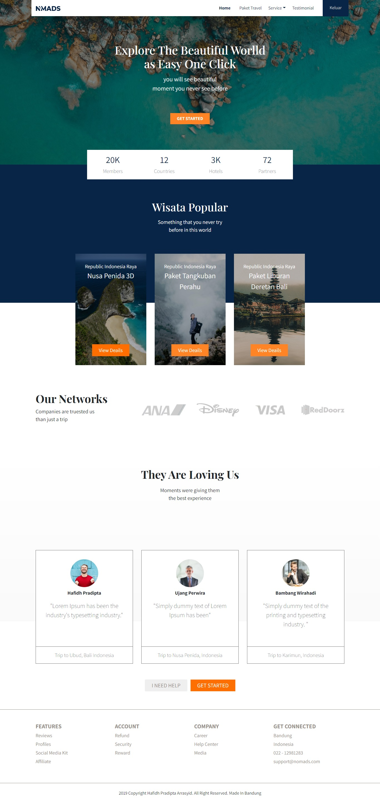
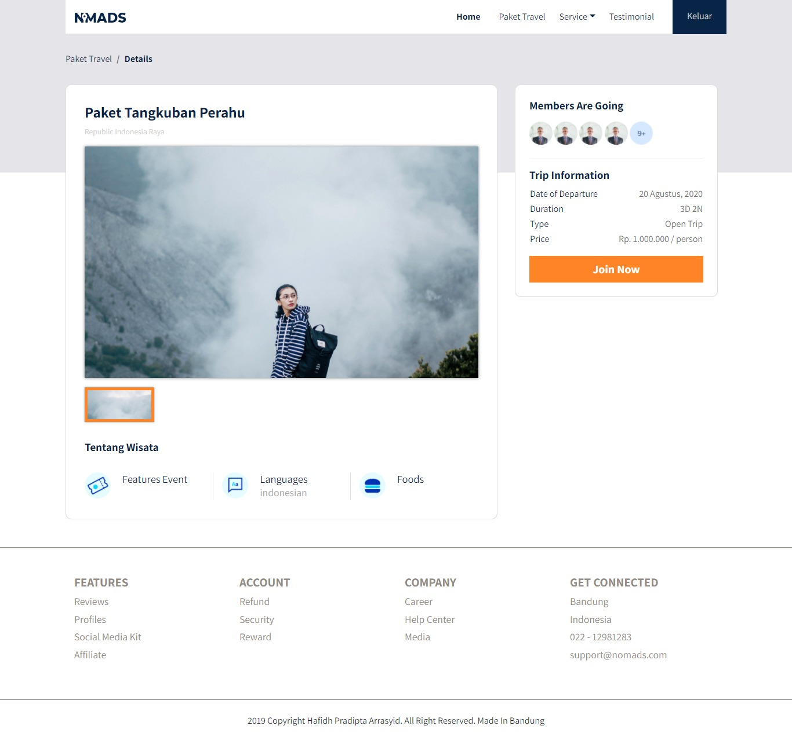
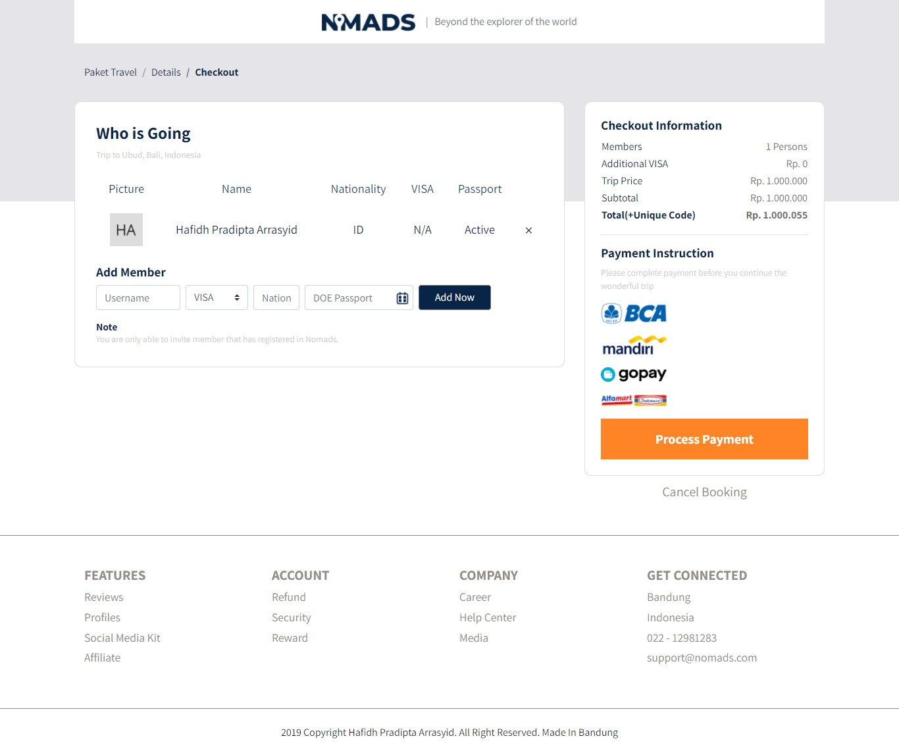

# Travel BWA application
This project from course BWA https://www.buildwithangga.com/kelas/full-stack-web-developer

## Installation
how to install and setup in your machine?
  - Clone or download this project
  - Run `composer install`
  - Create database with name you want
  - Copy and paste .env.example become .env
  - Run `php artisan key:generate`
  - Run `php artisan migrate`
  - Run `php artisan db:seed`
  - Run `php artisan serve`

## Feature 
  - I will update this later

## Screenshoot

